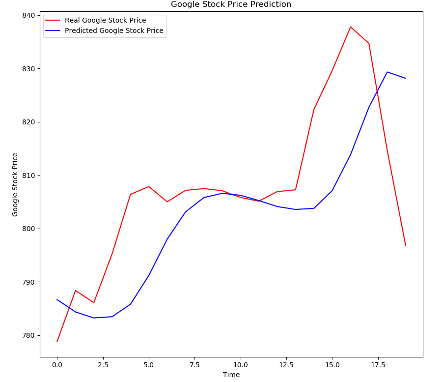

# LSTM_stocks_predict
For now, it's a basic code to predict stockprices based on .csv datasets.  

If you want to use your own dataset, dont forget to change the arguments of train() and test() functions.  
You can modify the number of `timesteps` too (in both files).  

## Tensorboard visualisation  
Open a terminal in ..\LSTM_stocks_predict folder and type `tensorboard --logdir Graph/`  
Then, copy/paste the link given on your browser.  

## Improvements to make  

* First, enabling the terminal commande with --dataset datasetfolder/datasetfile.csv , etc...  
* Adapting visualisation of the results (based on the name of the file, etc...)  
* User interface  
* ...  

